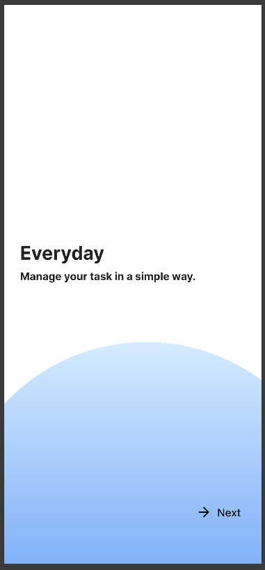
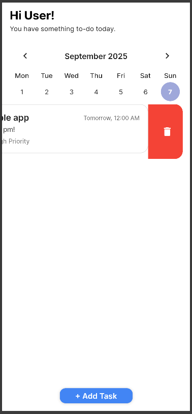
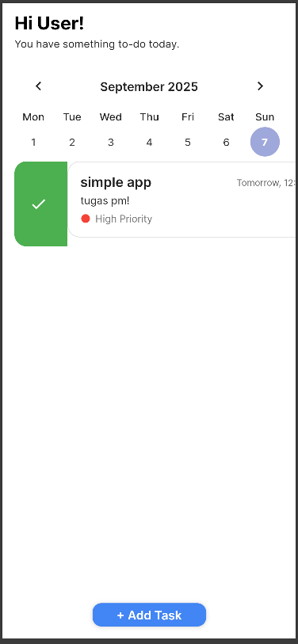
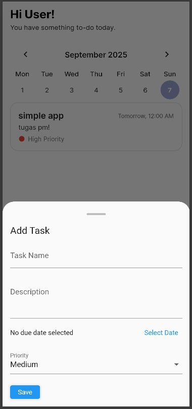
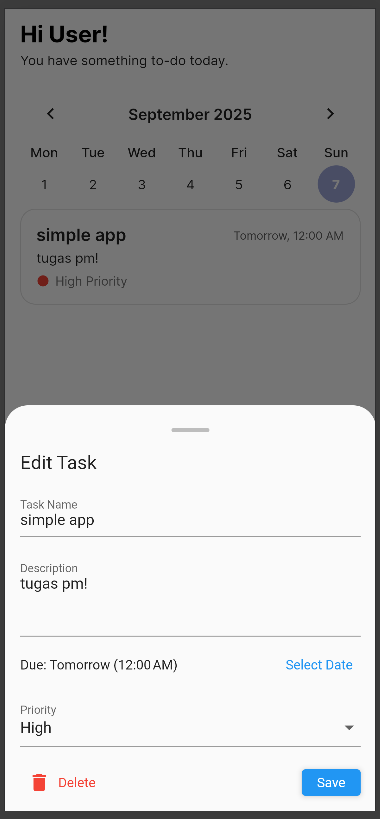

# Simple To-Do App ✅

## Deskripsi
Aplikasi **To-Do sederhana** menggunakan **Flutter**.  

## State & Alasan
Aplikasi ini menggunakan `setState` bawaan Flutter. Saya membangun simple to-do app karena lebih sederhana dan cukup mudah dipahami alur sistemnya.
  
## Screenshots

| Main | Delete | Completed | Add Task | Delete Task |
|------|-------|-----------|-----------|----------|
|  |  |  |  |  |

