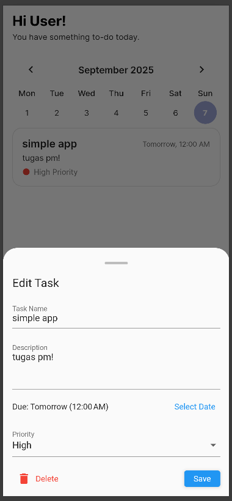

# Simple To-Do App ✅

A simple and lightweight To-Do application built with **Flutter**.  
This project is created to practice basic state management, UI design, and Git workflow.

## Features
- ➕ Add new tasks  
- ✅ Mark tasks as completed  
- ❌ Delete tasks  
- 📱 Responsive UI
  
## Screenshots

| Main | Delete | Completed | Add Task | Delete Task |
|------|-------|-----------|-----------|----------|
|  |  |  |  |  |

